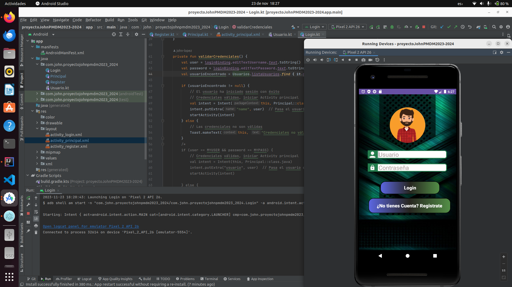
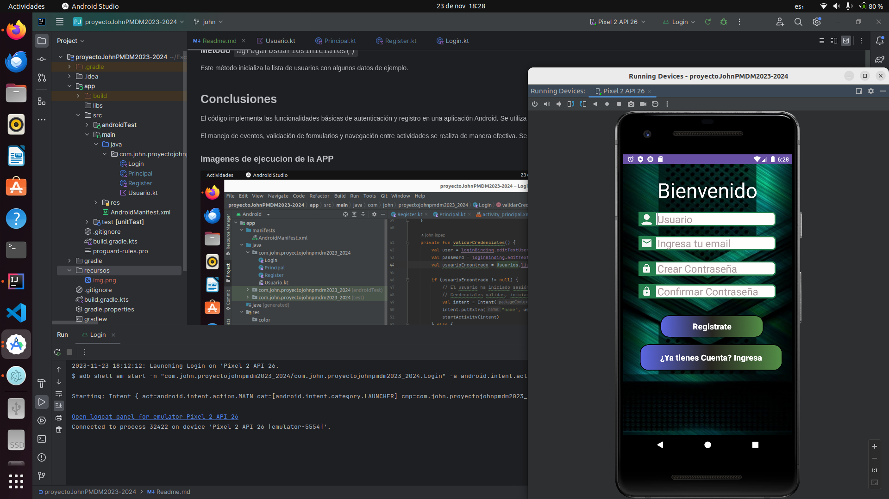
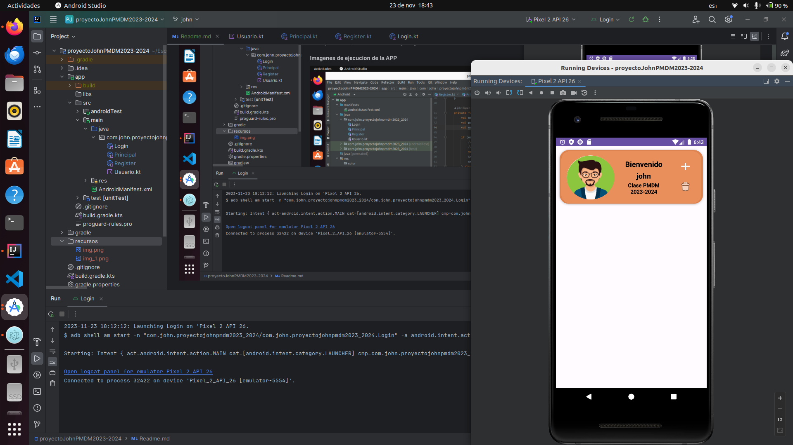

# Proyecto APP

## Introducción

Este documento proporciona una explicación detallada del código implementado para esta aplicación, que abarca las 
funcionalidades básicas de registro, inicio de sesión y una pantalla principal. La aplicación utiliza la arquitectura 
de Android con la librería de enlace de vista `ViewBinding`.

## Clase `Login`

La clase `Login` maneja la pantalla de inicio de sesión. Aquí se realiza la validación de las credenciales introducidas 
por el usuario. Además, se proporciona la opción para registrar un nuevo usuario.

## Métodos:

### Método `onCreate()`

Este método se llama cuando la actividad se inicia. Se encarga de inicializar la interfaz de usuario y establecer los 
eventos.

### Método `initEvents()`

Este método configura los eventos de los botones en la pantalla de inicio de sesión. Se encarga de llamar a las 
funciones correspondientes cuando se hace clic en los botones.

### Método `validarCredenciales()`

Este método verifica las credenciales ingresadas por el usuario comparándolas con la lista de usuarios almacenada en 
la clase `Usuarios`. Si las credenciales son válidas, se inicia la `PrincipalActivity`. Si no son válidas, se muestra 
un mensaje de error.

### Método `registerUser()`

Este método inicia la actividad de registro (`RegisterActivity`).

Codigo de la clase `Login`:

```kotlin
class Login : AppCompatActivity() {
    val MYTAG = "LOGCAT"
    private lateinit var loginBinding : ActivityLoginBinding
    override fun onCreate(savedInstanceState: Bundle?) {
        super.onCreate(savedInstanceState)
        loginBinding = ActivityLoginBinding.inflate(layoutInflater)
        setContentView(loginBinding.root)
        
        initEvents()
        Log.i(MYTAG,"que pasa")
    }

    private fun initEvents() {
        loginBinding.buttonLogin.setOnClickListener {
            validarCredenciales()
        }

        loginBinding.buttonRegistrar.setOnClickListener{
            registerUser()
        }

    }

    private fun validarCredenciales() {
        val user = loginBinding.editTextUsername.text.toString()
        val password = loginBinding.editTextPassword.text.toString()
        val usuarioEncontrado = Usuarios.listaUsuarios.find { it.name==user && it.password ==password }

        if (usuarioEncontrado != null) {
            // El usuario ha iniciado sesión con éxito
            // Credenciales válidas, iniciar Activity principal
            val intent = Intent(this, Principal::class.java)
            intent.putExtra("name", user)  // Pasa el usuario como argumento al Activity principal
            startActivity(intent)
        } else {
            // Las credenciales no son válidas
            Toast.makeText(this, "Credenciales no válidas", Toast.LENGTH_SHORT).show()
        }
       
    }
    private fun registerUser() {
        Log.i(MYTAG,"Entramos a registrar usuario")
        val  intent = Intent(this,Register::class.java)
        startActivity(intent)

    }
}
```

## Clase `Register`

La clase `Register` gestiona la pantalla de registro de nuevos usuarios.

### Método `onCreate()`

Este método se llama cuando la actividad se inicia. Configura la interfaz de usuario y establece los eventos.

### Método `initEvents()`

Este método configura los eventos de los botones en la pantalla de registro.

### Método `comprobarEstado()`

Este método verifica que los campos del formulario no estén vacíos y compara las contraseñas antes de registrar un nuevo usuario en la lista.

### Método `regresarLogin()`

Este método inicia la actividad de inicio de sesión (`LoginActivity`).

Codigo de la clase `Register`:

```kotlin
class Register : AppCompatActivity() {
    private lateinit var registerBinding: ActivityRegisterBinding
    override fun onCreate(savedInstanceState: Bundle?) {
        super.onCreate(savedInstanceState)
        registerBinding = ActivityRegisterBinding.inflate(layoutInflater)
        setContentView(registerBinding.root)

        initEvents()
    }

    private fun initEvents() {
        registerBinding.buttonSignUp.setOnClickListener{
            comprobarEstado()
        }
        registerBinding.buttonRegresarLogin.setOnClickListener{
            regresarLogin()
        }

    }


    private fun comprobarEstado() {
        val name = registerBinding.editTextUsername.text.toString()
        val email = registerBinding.editTextEmail.text.toString()
        val password = registerBinding.editTextPassword.text.toString()
        val confirmPassword = registerBinding.editTextTextPassword2.text.toString()
        // Verificar que ningún campo esté vacío
        if (name.isEmpty() || email.isEmpty() || password.isEmpty() || confirmPassword.isEmpty()) {
            // Mostrar un mensaje de error si algún campo está vacío
            val campo = "Campo no puede estar vacio"
            if(name.isEmpty())
                registerBinding.editTextUsername.error = campo
            if(email.isEmpty())
                registerBinding.editTextEmail.error = campo
            if (password.isEmpty())
                registerBinding.editTextPassword.error = campo
            if (confirmPassword.isEmpty())
                registerBinding.editTextTextPassword2.error = campo
            Toast.makeText(
                this, "Todos los campos deben ser completados",
                Toast.LENGTH_SHORT
            ).show()
            return
        }

        if (password == confirmPassword) {
            // Contraseña y confirmación coinciden, realiza el registro
            val usuario = Usuario(name, email, password)
            Usuarios.listaUsuarios.add(usuario)
            // Guarda la lista actualizada en el objeto Usuarios
            Usuarios.listaUsuarios = Usuarios.listaUsuarios
            Toast.makeText(
                this, "Usuario creado correctamente",
                Toast.LENGTH_SHORT
            ).show()
            val intent = Intent(this, Login::class.java)
            startActivity(intent)
        } else {
            // Contraseña y confirmación no coinciden, muestra un mensaje de error
            registerBinding.editTextPassword.error = "Las contraseñas no coinciden"
            registerBinding.editTextTextPassword2.error = "Las contraseñas no coinciden"
            Toast.makeText(
                this, "las contraseñas no coinciden",
                Toast.LENGTH_SHORT
            ).show()

            return
        }
    }

    private fun regresarLogin() {
        val intent = Intent(this, Login::class.java)
        startActivity(intent)
    }

}
```

## Clase `Principal`

La clase `Principal` representa la pantalla principal de la aplicación. Muestra un mensaje de bienvenida y el nombre 
del usuario que ha iniciado sesión.

### Método `onCreate()`

Este método se llama cuando la actividad se inicia. Configura la IU y realiza una animación simple.

### Método `initHandler()`

Este método utiliza un `Handler` para realizar una animación que oculta y muestra elementos de la IU.

### Método `login()`

Este método recupera el nombre de usuario de la actividad anterior y lo muestra en la IU.

Codigo de la clase `Principal`:

```kotlin
class Principal : AppCompatActivity() {
    private lateinit var principalBinding: ActivityPrincipalBinding
    override fun onCreate(savedInstanceState: Bundle?) {
        super.onCreate(savedInstanceState)
        principalBinding = ActivityPrincipalBinding.inflate(layoutInflater)
        setContentView(principalBinding.root)

        initHander()
        login()
    }

    private fun initHander() {
        val handler = Handler(Looper.getMainLooper()) //queremos que el tema de la IU, la llevemos al hilo principal.
        principalBinding.progressCircular.visibility = View.VISIBLE  //hacemos visible el progress
        principalBinding.cardview.visibility =   View.GONE //ocultamos el cardview.
        Thread{
            Thread.sleep( 2000)
            handler.post{
                principalBinding.progressCircular.visibility = View.GONE //ocultamos el progress

                principalBinding.cardview.visibility = View.VISIBLE
                Toast.makeText(this, "Estamos en la pantalla principal",
                    Toast.LENGTH_SHORT).show()
            }
        }.start()
    }
    private fun login() {
        val txtName = principalBinding.textnombre
        val name = intent.getStringExtra("name")
        if (name!= null){
            txtName.text = "$name"
        }
    }
}
```

## Clase `Usuario`

La clase `Usuario` define la estructura de un usuario con propiedades como nombre, email y contraseña.


## Clase `Usuarios`

La clase `Usuarios` es un objeto único que almacena una lista de usuarios.

### Método `agregarUsuariosIniciales()`

Este método inicializa la lista de usuarios con algunos datos de ejemplo.


## Conclusiones

El código implementa las funcionalidades básicas de autenticación y registro en una aplicación Android. Se utiliza 
`ViewBinding` para una vinculación segura de vistas y se estructura la lógica del negocio en clases separadas.

El manejo de eventos, validación de formularios y navegación entre actividades se realiza de manera efectiva. Se utiliza
un `Handler` para crear una animación de carga en la pantalla principal.

## Imagenes de ejecucion de la APP

### Pantalla de Inicio de Sesión (Login):

- El usuario inicia la aplicación y se presenta con la pantalla de inicio de sesión.
- Ingrese su nombre de usuario y contraseña.
- La aplicación valida las credenciales introducidas y muestra un mensaje de error si no son válidas.
- Existe la opción de registrar un nuevo usuario, que lleva a la pantalla de registro.

### Imagen login




### Pantalla de Registro (Register):

- El usuario accede a la pantalla de registro desde la pantalla de inicio de sesión.
- Completa un formulario con su nombre, correo electrónico, contraseña y confirmación de contraseña.
- La aplicación valida los campos del formulario y muestra mensajes de error si es necesario.
- Si la validación es exitosa, se crea un nuevo usuario y se redirige de nuevo a la pantalla de inicio de sesión.

### Imagen formulario de registro




### Pantalla Principal (Principal):

- Después de iniciar sesión correctamente, el usuario es dirigido a la pantalla principal.
- Se muestra un mensaje de bienvenida junto con el nombre del usuario que inició sesión.
- Se utiliza un Handler para realizar una animación de carga antes de mostrar completamente la interfaz principal.

### Imagen pantalla principal:




### Validaciones y Restricciones:

- Las credenciales del usuario se validan durante el inicio de sesión.
- En el registro, se realizan diversas validaciones, como campos no vacíos y coincidencia de contraseñas.


[Repositorio:https://github.com/johnlopez0505/proyectoJohnPMDM2023-2024.git](https://github.com/johnlopez0505/proyectoJohnPMDM2023-2024.git)


